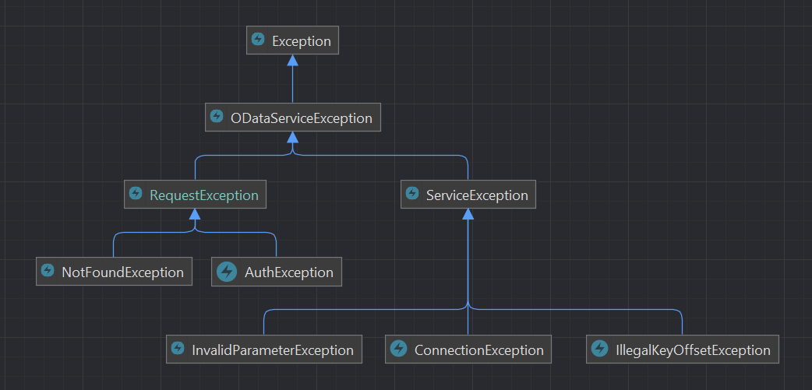

# 1C OData.
Клиент для работы с 1С по протоколу OData.  
[Документация по работе с 1C через OData](https://its.1c.ru/db/v838doc#bookmark:dev:TI000001358) (Для чтения требуется подписка 1С:ИТС).

Установка:
_________________
* через Composer:
```
composer require alexsmirnovdotcom/odata
```

* или просто скопируйте репозиторий к себе в проект.

##Использование
_________________
### 1) Инициализация:  

* вручную:
```php
$odata = (new Alexsmirnovdotcom\Odata\OData())
    ->setHost('dbURI')
    ->authAs(['login', 'password']);
```
* или передать экземпляр класса  `\Alexsmirnovdotcom\Odata\Config` в конструктор:
```php
$config = new \Alexsmirnovdotcom\Odata\Config(
    'dbURI',
    ['login', 'password'],
    ['Accept' => 'atom/xml', 'Content-Type' => 'atom/xml'],
    ['timeout' => 500]
);

$odata = new \Alexsmirnovdotcom\Odata\OData($config);
```
Конструктор `\Alexsmirnovdotcom\Odata\Config` принимает следующие параметры:

| Параметр                  | Описание                                                                                                                              |
|---------------------------|---------------------------------------------------------------------------------------------------------------------------------------|
| `string $host`            | URI базы данных.                                                                                                                      |
| `array $auth`             | Данные для аутентификации, в виде массива `['login', 'password']`                                                                     |
| `array $headers`          | Заголовки запроса в виде массива. По умолчанию устанавливаются `['Accept'=>'application/json', 'Content-Type' => 'application/json']` |
| `array $clientParameters` | Доп. параметры запроса (для Guzzle клиента), например `['timeout' => 500]`.                                                           |
Все эти параметры можно так же установить используя сеттеры для каждого параметра по отдельности.

### 2) Использование:
* получение коллекции
```php
$response = $odata->from('Document_СчетНаОплатуПокупателю')
    ->limit(25)
    ->select([
        'Ref_Key',
        'Number',
        'Date',
        'Организация/Ref_Key/Description',
        'Контрагент/Ref_Key/Description',
        'СуммаДокумента',
        'Комментарий'
    ])
    ->expand([
        'Контрагент',
        'Организация'
    ])
    ->get(); 
```
* получение конкретной сущности:
```php
$response = $odata->from('Document_СчетНаОплатуПокупателю')
    ->select([
        'Ref_Key',
        'Number',
        'Date',
        'Организация_Key',
        'Контрагент_Key',
        'СуммаДокумента',
        'Комментарий'
    ])
    ->get('00000000-0000-0000-0000-000000000000');
```
* Создание записи:
```php
$response = $odata->resource('Document_СчетНаОплатуПокупателю')
    ->create([
        "Организация_Key" => "00000000-0000-0000-0000-000000000000",
        "Склад_Key" => "00000000-0000-0000-0000-000000000000",
        "ПодразделениеОрганизации_Key" => "00000000-0000-0000-0000-000000000000",
        "Контрагент_Key" => "00000000-0000-0000-0000-000000000000",
        "ДоговорКонтрагента_Key" => "00000000-0000-0000-0000-000000000000",
        "Товары" => [
            [
                "Ref_Key" => "00000000-0000-0000-0000-000000000000",
                "LineNumber" => "1",
                "Номенклатура_Key" => "00000000-0000-0000-0000-000000000000",
                "Содержание" => "Невероятная услуга",
                "Количество" => 1,
                "Цена" => 2100,
                "Сумма" => 2100,
                "ПроцентСкидки" => 0,
                "СуммаСкидки" => 0,
                "СтавкаНДС" => "НДС20",
                "СуммаНДС" => 320.34,
                "КлючКалькуляцииРасходов" => "00000000-0000-0000-0000-000000000000"
            ],
            [
                "Ref_Key" => "00000000-0000-0000-0000-000000000000",
                "LineNumber" => "2",
                "Номенклатура_Key" => "00000000-0000-0000-0000-000000000000",
                "Содержание" => "",
                "Количество" => 1,
                "Цена" => 1400,
                "Сумма" => 1400,
                "ПроцентСкидки" => 0,
                "СуммаСкидки" => 0,
                "СтавкаНДС" => "НДС20",
                "СуммаНДС" => 213.56,
                "КлючКалькуляцииРасходов" => "00000000-0000-0000-0000-000000000000"
            ],
        ]
    ]);
```
* Изменение записи: 
```php
$response = $odata->resource('Document_СчетНаОплатуПокупателю')
    ->update(
        "00000000-0000-0000-0000-000000000000",
        ["Организация_Key" => "00000000-0000-0000-0000-000000000000"]
    ); 
```
* Пометка об удалении:
```php
$response = $odata->resource('Document_СчетНаОплатуПокупателю')
    ->markDeleted("00000000-0000-0000-0000-000000000000");
```
* Уничтожение записи: **Используйте с осторожностью!**
```php
$response = $odata->resource('Document_СчетНаОплатуПокупателю')
    ->forceDelete("00000000-0000-0000-0000-000000000000");
```
При успешном запросе в `$response` будет экземпляр объекта `\Alexsmirnovdotcom\Odata\Response` с данными ответа.
При неудачном запросе или ошибке, будет выброшено исключение. Типы исключений будут описаны ниже.

### 3) Работа с объектом ответа `\Alexsmirnovdotcom\Odata\Response`:
Доступные методы:

| Метод                                    | Описание                                                                                                                                          |
|------------------------------------------|---------------------------------------------------------------------------------------------------------------------------------------------------|
| `$response->getCode(): int`              | Возвращает код ответа от сервера (Status Code).                                                                                                   |
| `$response->getMessage(): ?string`       | Возвращает cообщение полученное от сервера (Reason Phrase).                                                                                       |
| `$response->getBody($key = null): mixed` | Возвращает тело запроса из json строки в виде массива. Возвращает только значение по этому ключу или выбрасывает KeyNotExistsInResponseException. |

При вызове метода `$response->getBody()` без переданного `$key` будет возвращен массив полученный из json строки ответа сервера.  
При переданном `$key` в виде строкового ключа, будет возвращена только часть массива с этим ключом (например 'value' при запросе коллекции) или будет выброшено исключение `KeyNotExistsInResponseException` если такой ключ отсутствует в массиве.  
При переданном `$key` в виде callback функции, будет возвращен результат ее выполнения.  
В параметры этой callback функции будет передано тело ответа от сервера в виде строки, без каких либо преобразований.  
Полезно, например если вы ходите получить и обработать данные в виде atom/xml.  
Не забудьте во время запроса стереть или изменить заголовки 'Accept' и 'Content-Type' которые по умолчанию установлены в 'application/json'.


[//]: # (Для работы с телом ответа по своему, в метод `getBody&#40;$key&#41;` через `$key` можно передать свой callback, который)

[//]: # (в качестве параметра примет тело ответа в виде строки &#40;как пришло с сервера&#41; и работать с ним по своему)

[//]: # (усмотрению. Метод вернет результат работы переданного callback.)

## Обработка ошибок:
### Стандартная структура классов исключений:


Исключения делятся на 2 категории:
* Ошибки запроса (когда запрос выполнен, но вернулся с ошибкой)
* Все остальные исключения Guzzle или Odata клиента.

Вы можете использовать свой обработчик исключений при запросах, для этого нужно передать его в метод:
```php
(new \Alexsmirnovdotcom\Odata\OData())->setRequestExceptionHandler();
```
Обработчик должен реализовать интерфейс `\Alexsmirnovdotcom\Odata\Interfaces\RequestExceptionHandlerInterface` c одним единственным методом `handle()` куда и будет передано исключение для обработки.


При стандартной обработке исключений используется следующая схема:  
* На `\GuzzleHttp\Exception\RequestException` в зависимости от кода ответа генерируются:

| Код       | Исключение                                              |
|-----------|---------------------------------------------------------|
| 401       | `\Alexsmirnovdotcom\Odata\Exceptions\AuthException`     |
| 404       | `\Alexsmirnovdotcom\Odata\Exceptions\NotFoundException` |
| остальные | `\Alexsmirnovdotcom\Odata\Exceptions\RequestException`  |

В `\Alexsmirnovdotcom\Odata\Exceptions\RequestException` и всех его потомков передается оригинальный `GuzzleHttp\Psr7\Response` или `null`.
Что бы его получить, необходимо вызвать метод `$exception->getResponse()`.


* На `\GuzzleHttp\Exception\ConnectException` генерируется `\Alexsmirnovdotcom\Odata\Exceptions\Service\ConnectionException`.
В него передается массив с информацией запроса. Чтобы получить его необходимо вызвать метод `$exception->getDebug()`.


* На `\GuzzleHttp\Exception\GuzzleException` генерируется `\Alexsmirnovdotcom\Odata\Exceptions\ODataServiceException`.
Все остальные прокидываются выше.


* `\Alexsmirnovdotcom\Odata\Exceptions\Service\InvalidParameterException` будет выброшено если в методы:
`get()`, `update()`, `markDeleted()`, `forceDelete()` передан GUID в неверном формате, или во время запроса если не указан URI базы.  


* `\Alexsmirnovdotcom\Odata\Exceptions\Service\IllegalKeyOffsetException` будет выброшено при попытке вызова метода `Alexsmirnovdotcom\Odata\Response->getBody($key)` с отсутствующим в массиве ключом `$key`.  
В это исключение передается экземпляр объекта ответа `Alexsmirnovdotcom\Odata\Response`, получить его можно вызвав `$exception->getResponse()`.  
При использовании callback в качестве `$key` генерация ошибок на ваше усмотрение. Метод вернет результат работы переданного callback.